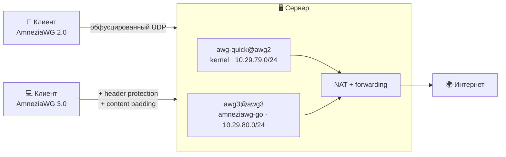

<div align="center">

# AWG3

**VPN-сервер на AmneziaWG 2.0 и 3.0. Одна команда — и всё готово.**

[](LICENSE)
[](https://github.com/amnezia-vpn/amneziawg-go)
[](#требования)
[](#)
[](#telegram-бот)

Клиенты, статистика, обфускация и обновления — из меню в терминале или из Telegram.
Ничего лишнего на сервере: только VPN.

</div>

---

## Зачем это

Обычный WireGuard узнаётся по первому же пакету: у него фиксированные заголовки и характерные размеры. Там, где трафик разбирают, этого достаточно, чтобы туннель просто перестал работать.

**AmneziaWG** решает это на уровне транспорта: рандомизирует заголовки, добавляет junk-пакеты и подмешивает мимикрию под привычные протоколы. **Версия 3.0** идёт дальше — шифрует сами заголовки (header protection), добавляет паддинг контента и рандомизирует тайминги, из-за которых WireGuard раньше опознавался по регулярности служебных пакетов.

Этот проект ставит такой сервер целиком: собирает всё из исходников, генерирует согласованный профиль обфускации, поднимает интерфейсы, NAT и автозапуск, даёт управление клиентами из меню и из Telegram. Никаких внешних сервисов, никаких зависимостей от чужих скриптов — сервер живёт сам по себе.

## Два слоя, независимые друг от друга

| | **AmneziaWG 2.0** | **AmneziaWG 3.0** |
|---|---|---|
| датапас | kernel-модуль | userspace `amneziawg-go` |
| обфускация | junk-пакеты, рандомные заголовки, мимикрия | то же + **header protection**, **content padding**, **рандомные тайминги** |
| клиенты | любые сборки AmneziaWG | только свежие приложения |
| скорость | максимальная | чуть ниже (обработка в userspace) |

Слои поднимаются **одновременно и не мешают друг другу**: у каждого свой интерфейс, своя подсеть, свой UDP-порт и свой профиль обфускации. Практический смысл простой — тем, у кого свежее приложение, выдаёшь клиента 3.0, остальным 2.0, и никто ничего не теряет.

> Почему 3.0 не на модуле: kernel-модуль знает параметры только до 2.0, а `awg-quick` молча уходит в него, если модуль загружен. То есть на сервере с модулем «просто конфиг 3.0» тихо поднялся бы как 2.0. Поэтому датапас 3.0 запускается явным демоном, а параметры 3.0 применяются через его UAPI-сокет — утилиты `amneziawg-tools` их не понимают.

## Что внутри

- **Установка одной командой** — интерактивно спросит версию протокола, обфускацию, домен и бота. Всё остальное сделает сам: соберёт `amneziawg-go`, `amneziawg-tools` и kernel-модуль из исходников.
- **Меню в терминале** — команда `awg3` из-под root. Клиенты, QR прямо в консоли, статистика, обфускация, бэкапы, диагностика, полное удаление.
- **Telegram-бот** — то же самое кнопками из чата: клиенты с конфигом, QR и ссылкой `vpn://`, статистика с гео, бэкап, обновление, диагностика.
- **Клиент в один тап** — `.conf`, QR-код и ссылка `vpn://` для приложения Amnezia. Ссылка собирается так, как её ждёт само приложение: с версией протокола и всеми параметрами.
- **Временные клиенты** с автоудалением по сроку (`6h`, `7d`, `30d`).
- **Настраиваемая обфускация** — пресеты интенсивности и шаблоны мимикрии под QUIC, TLS, DNS, VoIP. Профиль применяется одинаково к серверу и клиентам.
- **Рандомный UDP-порт** из свободных, закрепляется навсегда — от него зависят выданные конфиги.
- **Домен вместо IP** в `Endpoint`: при переезде сервера клиентов не придётся перевыпускать. Установщик проверит, что домен резолвится в адрес сервера.
- **Статистика** — трафик по клиентам и дням, кто онлайн, история подключений с городом и провайдером, раздельно по слоям.
- **Диагностика `awg-doctor`** — проходит цепочку от forwarding до handshake и говорит, где рвётся. С `--deep` поднимает настоящий туннель в сетевом namespace и гоняет через него трафик — отдельно для каждого слоя.
- **Бэкап одной командой**, при желании зашифрованный (AES-256): ключи сервера, все клиенты, профили и статистика.
- **Полное удаление** — сервисы, интерфейсы, правила NAT, ключи, клиенты, собранные бинарники и кэш сборки.

## Как это работает



Весь трафик клиента уходит в туннель (`AllowedIPs = 0.0.0.0/0, ::/0`) и выходит наружу через NAT сервера. Правила NAT живут ровно столько, сколько поднят интерфейс: поднялся — появились, остановлен — снялись.

## Требования

- **Ubuntu 22.04+ или Debian 12+**, root-доступ, чистый сервер (ничего доустанавливать заранее не нужно).
- Ядро с заголовками — для слоя 2.0 собирается kernel-модуль. Если модуль не соберётся, установщик скажет об этом и поднимет только слой 3.0.
- Для бота: Python 3 и `venv` — ставятся автоматически, зависимости живут в изолированном окружении `/opt/awg3/venv`.

## Установка

```bash
bash <(curl -fsSL https://raw.githubusercontent.com/blindtechnique/awg3/main/install.sh)
```

Установщик спросит:

1. **Версию протокола** — 2.0, 3.0 или обе сразу (по умолчанию обе).
2. **Интенсивность обфускации** и шаблон мимикрии.
3. **Домен или IP** для `Endpoint` клиентских конфигов — и проверит, что домен указывает на этот сервер.
4. **Ставить ли Telegram-бота** (можно позже).

Порты выбираются случайно из свободных и закрепляются навсегда. Дальше — команда `awg3`.

Без интерактива:

```bash
bash <(curl -fsSL https://raw.githubusercontent.com/blindtechnique/awg3/main/install.sh) --awg both --host vpn.example.com --preset medium --no-bot
```

### Флаги установщика

| Флаг | Что делает |
|---|---|
| `--awg 2\|3\|both` | какие версии поднять (по умолчанию спросит) |
| `--host HOST` | домен или IP для `Endpoint` клиентских конфигов |
| `--preset X --template Y` | обфускация без вопросов |
| `--ports A,B` | зафиксировать UDP-порты (2.0, 3.0) |
| `--dns "1.1.1.1, 8.8.8.8"` | DNS, который получат клиенты |
| `--no-bot` | не спрашивать про Telegram-бота |
| `--install-bot [токен chat_id]` | доустановить бота после установки |
| `--remove-bot` | удалить только бота |
| `--update` | обновить код **без** смены обфускации, портов и клиентов |
| `--reconfigure` | новый профиль обфускации (клиентам нужны новые конфиги) |
| `--uninstall` | удалить всё, что поставил скрипт |

## Меню в терминале

```
awg3
```

```
╔══════════════════════════════════════════════╗
║  AmneziaWG 2.0 + 3.0                         ║
║  vpn.example.com                             ║
╚══════════════════════════════════════════════╝

   1) Состояние            7) Информация о сервере
   2) Список клиентов      8) Обфускация
   3) Новый клиент         9) Диагностика
   4) Показать конфиг     10) Бэкап и восстановление
   5) Удалить клиента     11) Сервисы и журналы
   6) Статистика          12) Telegram-бот
                          13) Удалить AmneziaWG полностью
```

Новый клиент показывает QR-код прямо в терминале — можно сразу сканировать приложением. Короткие команды тоже работают:

```bash
awg3 add ivan awg3        # клиент слоя 3.0
awg3 add guest awg2 --ttl 6h
awg3 list awg2
awg3 del ivan awg3
awg3 doctor
awg3 stats
```

> Команда называется `awg3`, а не `awg`, чтобы не перекрывать утилиту `awg` из `amneziawg-tools` — на неё опираются и внутренние скрипты, и `awg-quick`.

## Telegram-бот

Одна команда — `/start`, дальше всё кнопками.

```
🔐 AmneziaWG 2.0 + 3.0 · vpn.example.com
├─ 👥 Клиенты
│   ├─ ➕ AmneziaWG 2.0 / 3.0 → версия → имя → конфиг, QR и vpn://
│   ├─ ⏳ Временный клиент     (1 час … 30 дней, удалится сам)
│   └─ 📋 Список → клиент → ℹ️ Информация · 📥 Скачать · 🗑 Удалить
├─ ℹ️ Информация       CPU / RAM / диск / аптайм, онлайн, топ-5, трафик
├─ 🩺 Диагностика      проверка по слоям · глубокая · конфиги клиентов
├─ 🔄 Обновление
│   ├─ 🔎 Проверить обновления    (версии amneziawg-go, tools и кода)
│   ├─ 🧬 Обновить код сервера
│   └─ 🛠 Перенастроить обфускацию
├─ 🛡 Обфускация        показать / сменить — отдельно для 2.0 и 3.0
├─ 💾 Бэкап
└─ ♻️ Восстановить      (принимает загруженный архив)
```

Доступ — только по списку `AWG_BOT_ADMINS`. Токен хранится в `/opt/awg3/bot.env` с правами `600`, а не в systemd-юните: юниты читаются всеми пользователями системы.

**Карточка клиента** показывает онлайн-статус, текущий IP с городом и провайдером, историю подключений, трафик за сессию и за всё время — с пометкой слоя.

## Обфускация

**Пресеты интенсивности:** `router` · `low` · `medium` (по умолчанию) · `high` · `paranoid`.

**Шаблоны мимикрии:** `quic` · `tls` · `web` · `voip` · `dns` · `mixed`. Выбирай протокол, который у твоего провайдера точно ходит.

Профиль генерируется один раз и применяется одинаково к серверу и всем клиентам — иначе handshake невозможен. У каждого слоя профиль свой: в 3.0 к обычным параметрам добавляются ключ header protection, диапазон паддинга и разброс таймингов.

```bash
awg-obfuscation --show            # текущий профиль слоя 2.0
awg-obfuscation --v3 --show       # то же для 3.0
awg-obfuscation --regenerate      # новые сигнатуры, тот же пресет
```

После смены профиля клиентские конфиги пересобираются автоматически — их нужно переимпортировать на устройствах.

## Диагностика

```bash
awg-doctor            # быстрая проверка: юниты, порты, NAT, профили, клиенты
awg-doctor --deep     # + настоящий туннель в namespace и трафик через него
awg-doctor --json     # для мониторинга
```

| Симптом | Причина / решение |
|---|---|
| нет интерфейса | `journalctl -u awg-quick@awg2` или `journalctl -u awg3@awg3` |
| `__AWG_OBFUSCATION__` в конфиге | профиль не применился → `awg-obfuscation --regenerate` |
| handshake есть, интернета нет | NAT или forwarding → `awg-doctor` покажет, что именно |
| peer есть, handshake нет | профиль клиента ≠ профиля сервера → выдай свежий конфиг |
| клиент 3.0 не подключается, 2.0 работает | приложение старое: параметры 3.0 понимают только свежие сборки |
| приложение пишет «AmneziaWG Legacy» | импортируй ссылку `vpn://`, а не `.conf` — при импорте файла приложение отбрасывает часть параметров |
| модуль не собрался | `dkms status`, лог сборки; слой 3.0 при этом работает без модуля |

## Обновление и удаление

Обновить код (обфускация, порты и клиенты не меняются):

```bash
bash <(curl -fsSL https://raw.githubusercontent.com/blindtechnique/awg3/main/install.sh) --update
```

Сменить профиль обфускации (клиентам понадобятся новые конфиги):

```bash
bash <(curl -fsSL https://raw.githubusercontent.com/blindtechnique/awg3/main/install.sh) --reconfigure
```

Удалить всё — сервисы, интерфейсы, правила NAT, ключи, клиентов, статистику, собранные бинарники и кэш сборки:

```bash
bash <(curl -fsSL https://raw.githubusercontent.com/blindtechnique/awg3/main/install.sh) --uninstall
```

То же самое доступно из меню `awg3` — пункты «Обновление» и «Удалить AmneziaWG полностью». Перед удалением скрипт перечислит, что именно снесёт, и переспросит.

## Бэкап

```bash
awg-backup backup              # архив рядом, права 600
awg-backup backup --encrypt    # AES-256, спросит пароль
awg-backup restore файл.tar.gz # .enc распознаётся автоматически
```

В архиве ключи сервера, профили обфускации, план сервисов, **все клиентские конфиги** и накопленная статистика. Приватные ключи клиентов существуют только в их конфигах — без этого каталога сервер поднимется, но клиентов пришлось бы выдавать заново. Шифрование стоит включать, если архив уезжает в чат или в облако.

## Что где лежит

| Путь | Что это |
|---|---|
| `/opt/awg3` | код, клиентские конфиги, статистика, venv бота |
| `/etc/amnezia/amneziawg` | ключи сервера, профили обфускации, план сервисов |
| `/etc/systemd/system/awg3@.service` | юнит userspace-датапаса для слоя 3.0 |
| `/opt/src` | исходники, из которых всё собрано |

## На чём основано

- [amnezia-vpn/amneziawg-go](https://github.com/amnezia-vpn/amneziawg-go) — userspace-датапас, на нём работает слой 3.0.
- [amnezia-vpn/amneziawg-linux-kernel-module](https://github.com/amnezia-vpn/amneziawg-linux-kernel-module) — kernel-модуль для слоя 2.0.
- [amnezia-vpn/amneziawg-tools](https://github.com/amnezia-vpn/amneziawg-tools) — утилиты `awg` и `awg-quick`.
- [amnezia-vpn/amnezia-client](https://github.com/amnezia-vpn/amnezia-client) — клиентское приложение, под формат которого собираются ссылки `vpn://`.
- [bivlked/amneziawg-installer](https://github.com/bivlked/amneziawg-installer) и [Vadim-Khristenko/AmneziaWG-Architect](https://github.com/Vadim-Khristenko/AmneziaWG-Architect) — подходы к установке AWG и генерации мимикрии.

## Лицензия

[GPLv3](LICENSE). Свободно используй, меняй и распространяй — производные тоже остаются открытыми.
