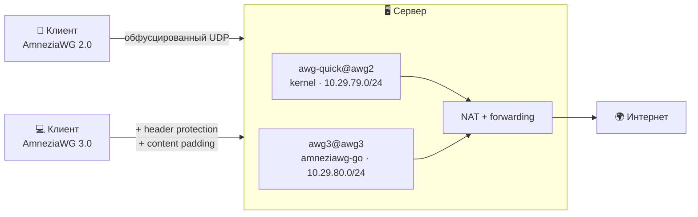

<div align="center">

# AWG3

**VPN-сервер на AmneziaWG 2.0 и 3.0. Одна команда — и всё готово.**

[](LICENSE)
[](https://github.com/amnezia-vpn/amneziawg-go)
[](#требования)
[](#)
[](#telegram-бот)

Клиенты, статистика, обфускация и бэкапы — из меню в терминале или из Telegram; обновления — из Telegram или командой установщика.
Ничего лишнего на сервере: только VPN.

</div>

---

## Зачем это

Обычный WireGuard узнаётся по первому же пакету: у него фиксированные заголовки и характерные размеры. Там, где трафик разбирают, этого достаточно, чтобы туннель просто перестал работать.

**AmneziaWG** решает это на уровне транспорта: рандомизирует заголовки, добавляет junk-пакеты и подмешивает мимикрию под привычные протоколы. **Версия 3.0** идёт дальше — шифрует сами заголовки (header protection), добавляет паддинг контента и рандомизирует тайминги, из-за которых WireGuard раньше опознавался по регулярности служебных пакетов.

Этот проект ставит такой сервер целиком: собирает всё из исходников, генерирует согласованный профиль обфускации, поднимает интерфейсы, NAT и автозапуск, даёт управление клиентами из меню и из Telegram. Никаких зависимостей от чужих панелей и скриптов — управление целиком на самом сервере.

> [!NOTE]
> Два места, где сервер всё же ходит наружу: определение собственного внешнего
> адреса (`api.ipify.org` — при установке и при выдаче клиента без домена) и
> город с провайдером в статистике — она спрашивает `ip-api.com` **по HTTP** и
> кэширует ответ в `stats.db`, то есть на сервере копится сопоставление
> «клиент → провайдер». Если это лишнее, гео отключается удалением вызова
> `geoip()` в `awg_stats.py` — на работу VPN не влияет.

## Два слоя, независимые друг от друга

| | **AmneziaWG 2.0** | **AmneziaWG 3.0** |
|---|---|---|
| датапас | kernel-модуль | userspace `amneziawg-go` |
| обфускация | junk-пакеты, рандомные заголовки, мимикрия | то же + **header protection**, **content padding**, **рандомные тайминги** |
| клиенты | любой клиент с поддержкой AmneziaWG **2.0** (S3/S4, I1–I5) | приложение Amnezia **5.0.0.2** и новее |
| скорость | максимальная | чуть ниже (обработка в userspace) |

Слои поднимаются **одновременно и не мешают друг другу**: у каждого свой интерфейс, своя подсеть, свой UDP-порт и свой профиль обфускации. Практический смысл простой — тем, у кого свежее приложение, выдаёшь клиента 3.0, остальным 2.0, и никто ничего не теряет.

Приложение 5.0.1.5 подписывает наш конфиг 3.0 как «AmneziaWG (version 3.1)» — и это не описка. Начиная с 5.0 клиент перестал верить полю `protocol_version` из ссылки и считает версию сам: любой непустой параметр слоя 3 — у нас это `HeaderProtectionKey` — сразу даёт тройку, а знает он ровно одну, `3.1`; строки «3.0» в приложении нет вообще. Сборки до 5.0.1.5 (например 5.0.0.2 и 5.0.0.5) той же ссылке напишут «version 2»: параметры слоя 3 они уже понимают, а константы «3.1» в них ещё нет. На работу это не влияет ни там, ни там — параметры 3.0 передаются и применяются полностью.

### Почему слой 3.0 не в ядре и когда будет

Раньше причина была простой: kernel-модуль не знал параметров 3.0. Сейчас знает — апстрим влил [PR #192](https://github.com/amnezia-vpn/amneziawg-linux-kernel-module/pull/192) в `master` 30 июля 2026. Но переезд **отложен**, и вот почему.

| Что мешает | Состояние |
|---|---|
| [kmod #215](https://github.com/amnezia-vpn/amneziawg-linux-kernel-module/issues/215) | Регрессия ровно на переходе 3.0 → 3.1: хендшейк проходит, трафик не идёт. Открыт с 15 августа, ответа мейнтейнеров нет. |
| [amnezia-client #3043](https://github.com/amnezia-vpn/amnezia-client/issues/3043) | То же самое, и репортёр отдельно проверил: **userspace 3.1 и kernel-модуль 3.1 ведут себя одинаково**. |
| Нет чистого тега | В `v3.0.20260805` — use-after-free в `send.c`. Исправление попало только внутрь `v3.1.20260812`, где и живёт регрессия выше. |

Поэтому проект держится **серии 3.0** и датапаса `amneziawg-go`, пин — `v3.0.20260805`. Флаги `--kmod3` и `--no-kmod3` **отключены** и выходят с кодом 2: ветка `feat/awg3`, из которой они собирали, удалена апстримом после мержа.

Формат конфигов к переезду уже готов: ключ header protection в base64 внутри `.conf`, диапазоны вида `118-134`, ChaCha20 с 32-байтным ключом и 12-байтным nonce. **Перевыпускать клиентов не придётся** — поменяется только датапас на сервере.

Следить за состоянием:

```bash
awg-upstream-check
```

Скрипт различает 3.0 и 3.1 в `master` модуля и называет причины отсрочки. Он **не** считает обновлением появление нового тега у апстрима: версия меняется вместе с кодом awg3, иначе уведомление горело бы вечно.

> [!NOTE]
> **Модуль нельзя подменить на работающей системе.** Пока он загружен, утилиты и модуль обязаны быть из одного набора. Если версии разойдутся, `awg` не выдаёт ошибку, а зависает намертво — процессы уходят в состояние `D`, счётчик ссылок модуля ломается, и спасает только перезагрузка. Установщик сначала собирает модуль и лишь потом гасит интерфейсы и выгружает старый; если выгрузить не удаётся — останавливается и просит перезагрузиться, не доводя систему до рассинхрона.

### А что с AmneziaWG 3.1

3.1 вышла 12 августа 2026 и добавляет два параметра: `RandomTrailers` (случайные байты в хвост пакета) и `DisableCookies` (не отправлять cookie-реплаи). Проект её **не использует** — по причинам из таблицы выше.

У `RandomTrailers` есть особенность, из-за которой его нельзя включить «просто так»: параметр **симметричный**. Если он задан только на одной стороне, хендшейк умирает молча — неотличимо от блокировки UDP. Значит поддержка нужна сразу во всех клиентских приложениях, а не только в самом свежем, иначе часть пользователей отвалится без единого сообщения об ошибке.

Приложение Amnezia знает 3.1 начиная с **5.0.1.5** (21 августа 2026), сборки под Android, Linux, macOS и Windows; ассета под iOS в релизе нет.

## Что внутри

- **Установка одной командой** — интерактивно спросит версию протокола, обфускацию, домен и бота. Всё остальное сделает сам: соберёт `amneziawg-go`, `amneziawg-tools` и kernel-модуль из исходников.
- **Меню в терминале** — команда `awg3` из-под root. Клиенты, QR прямо в консоли, статистика, обфускация, бэкапы, диагностика, полное удаление.
- **Telegram-бот** — то же самое кнопками из чата: клиенты с конфигом, QR и ссылкой `vpn://`, статистика с гео, бэкап, обновление, диагностика.
- **Клиент в один тап** — `.conf`, QR-код и ссылка `vpn://` для приложения Amnezia. Ссылка собирается так, как её ждёт само приложение: с версией протокола и всеми параметрами. Единственное, что до клиента через ссылку не доезжает, — MTU: при импорте `vpn://` приложение подставляет свой (1376 на десктопе, 1280 на мобильных) независимо от того, что в ссылке. Если MTU важен, импортируй `.conf` — там значение уважается.
- **Временные клиенты** с автоудалением по сроку (`6h`, `7d`, `30d`).
- **Настраиваемая обфускация** — пресеты интенсивности и шаблоны мимикрии под QUIC, TLS, DNS, VoIP. Профиль применяется одинаково к серверу и клиентам.
- **Рандомный UDP-порт** из свободных, закрепляется навсегда — от него зависят выданные конфиги.
- **Домен вместо IP** в `Endpoint`: при переезде сервера клиентов не придётся перевыпускать. Установщик проверит, что домен резолвится в адрес сервера.
- **Статистика** — трафик по клиентам и дням, кто онлайн, история подключений с городом и провайдером, раздельно по слоям.
- **Диагностика `awg-doctor`** — проходит цепочку от forwarding до handshake и говорит, где рвётся. С `--deep` поднимает настоящий туннель в сетевом namespace и гоняет через него трафик — отдельно для каждого слоя.
- **Бэкап одной командой**, при желании зашифрованный (AES-256): ключи сервера, все клиенты, профили и статистика.
- **Полное удаление** — сервисы, интерфейсы, правила NAT, ключи, клиенты, собранные бинарники и кэш сборки.

## Как это работает



Весь трафик клиента уходит в туннель (`AllowedIPs = 0.0.0.0/0, ::/0`). Наружу через NAT сервера выходит IPv4; IPv6 сервер не маршрутизирует вовсе — маршрут `::/0` внутри туннеля нужен для того, чтобы IPv6 не утекал мимо VPN. Правила NAT живут ровно столько, сколько поднят интерфейс: поднялся — появились, остановлен — снялись.

## Требования

- **Ubuntu 22.04+ или Debian 12+**, root-доступ, чистый сервер (ничего доустанавливать заранее не нужно).
- Ядро с заголовками — для слоя 2.0 собирается kernel-модуль. Установщик сам ставит `linux-headers-$(uname -r)` и проверяет `/lib/modules/$(uname -r)/build` перед сборкой модуля — то есть уже после опроса параметров и сборки `amneziawg-tools`, а не в самом начале. Не соберётся — скажет об этом, работающие интерфейсы не тронет и поднимет один слой 3.0. Если выбран **только** слой 2.0 (`--awg 2`), поднимать будет нечего: установка остановится с ошибкой.
- Для бота: Python 3 и `venv` — ставятся автоматически, зависимости живут в изолированном окружении `/opt/awg3/venv`.

## Установка

```bash
bash <(curl -fsSL https://raw.githubusercontent.com/blindtechnique/awg3/main/install.sh)
```

Установщик спросит:

1. **Версию протокола** — 2.0, 3.0 или обе сразу (по умолчанию обе).
2. **Интенсивность обфускации** и шаблон мимикрии.
3. **Домен или IP** для `Endpoint` клиентских конфигов — и проверит, что домен указывает на этот сервер.
4. **Ставить ли Telegram-бота** (можно позже).

Порты выбираются случайно из свободных и закрепляются навсегда. Дальше — команда `awg3`.

Без интерактива:

```bash
bash <(curl -fsSL https://raw.githubusercontent.com/blindtechnique/awg3/main/install.sh) --awg both --host vpn.example.com --preset medium --no-bot
```

### Флаги установщика

| Флаг | Что делает |
|---|---|
| `--awg 2\|3\|both` | какие версии поднять (по умолчанию спросит) |
| `--host HOST` (`--endpoint`) | домен или IP для `Endpoint` клиентских конфигов |
| `--preset X` | пресет обфускации без вопросов |
| `--template Y`, `--fp Z` | шаблон мимикрии и профиль браузера. Работают **только вместе с `--preset`** — без него молча игнорируются |
| `--preset3 X`, `--template3 Y` | обфускация **отдельно для слоя 3.0**. Пусто — как у слоя 2.0. Работают только вместе с `--preset` |
| `--mtu N` | MTU обоих слоёв сразу (по умолчанию 1420 у 2.0 и 1380 у 3.0) |
| `--ports A,B` | зафиксировать UDP-порты (2.0, 3.0) |
| `--dns "1.1.1.1, 8.8.8.8"` | DNS, который получат клиенты |
| `--no-bot` | не спрашивать про Telegram-бота |
| `--install-bot [токен chat_id]` | доустановить бота после установки |
| `--bot-token X` / `--bot-admins X` | то же без интерактива; работают только вместе с `--install-bot` |
| `--remove-bot` | удалить только бота |
| `--plan` | показать, что сделает эта же команда, и выйти, **ничего не изменив**: `--plan --update`, `--plan --reconfigure`, `--plan --reconfigure --awg 3`. С `--uninstall`, `--install-bot` и `--remove-bot` не сочетается — у этих операций отчёта нет, код возврата 2 |
| `--update` | обновить код **без** смены обфускации, портов и клиентов |
| `--reconfigure` | **полный повторный прогон**: заново спросит версию протокола, обфускацию, домен и бота, сгенерирует новый профиль обфускации (клиентам нужны новые конфиги) |
| `--uninstall` | удалить всё, что поставил скрипт |
| `--yes` / `-y` | отвечать «да» на подтверждения Y/N (удаление, установка бота). Пункты меню и ввод строк он не пропускает — для полностью неинтерактивного прогона задавай `--awg`, `--preset`, `--host` и `--no-bot` явно |
| `-h`, `--help` | список флагов |
| `--kmod3` / `--no-kmod3` | **отключены**, выходят с кодом 2 — см. [почему слой 3.0 не в ядре](#почему-слой-30-не-в-ядре-и-когда-будет) |

> [!WARNING]
> Пресеты `router` и `low` объявлены с `header_protection=False`,
> `content_padding=None` и `timings=False` — то есть **без главных признаков
> 3.0**. Слой, поднятый на них, обфусцирует ровно так же, как 2.0, и держать
> его отдельно смысла нет. Полный набор 3.0 начинается с `medium`. Установщик
> спрашивает пресет для слоя 3.0 отдельным вопросом и предупреждает об этом; в
> неинтерактивном прогоне за это отвечает `--preset3`.
>
> Диагностика (`awg-doctor`) на `router` и `low` пишет «без header protection,
> так и задумано» и не считает это поломкой.

> [!IMPORTANT]
> `--ports`, `--dns` и `--mtu` действуют **только на первой установке**: порты,
> подсети, DNS и MTU закрепляются в `/etc/amnezia/amneziawg/services.env` и
> дальше берутся оттуда. `--plan` перечисляет такие флаги как проигнорированные.
> Чтобы сменить порт или MTU, правь `services.env` руками, перезапускай юниты и
> перевыпускай клиентов (`awg-client regen-all`).
>
> Адрес — исключение: `--reconfigure --host новый.домен` его **меняет**. Ровно
> эту команду печатает `awg-backup restore`, когда видит в архиве адрес другой
> машины. Уже выданные конфиги при этом остаются со старым `Endpoint`
> (`regen-all` правит только блок обфускации), поэтому их придётся выпустить
> заново.

> [!WARNING]
> `--reconfigure` без терминала (cron, ansible, `ssh host 'bash -s' < install.sh`)
> вопросов задать не может и молча уходит в дефолты: `--awg both` и пресет
> `medium`. Сервер, поднятый как `--awg 3`, после такого прогона начнёт собирать
> kernel-модуль, а профиль `paranoid` заменится на `medium`. Для неинтерактивной
> перенастройки передавай `--awg` и `--preset` явно.

Версии апстрима переопределяются переменными окружения: `AWG_GO_REF`, `AWG_TOOLS_REF`, `AWG_KMOD_SRC_REF` (что клонировать, если модуль собирать всё-таки надо) и `AWG_KMOD_REF` (принудительная пересборка модуля; пусто по умолчанию — собранный модуль не трогается). Через `--update` доезжает только `AWG_GO_REF`: утилиты и модуль меняются полным прогоном установщика.

## Меню в терминале

```
awg3
```

```
╔══════════════════════════════════════════════╗
║  AmneziaWG 2.0 + 3.0                         ║
║  vpn.example.com                             ║
╚══════════════════════════════════════════════╝

   1) Состояние            7) Информация о сервере
   2) Список клиентов      8) Обфускация
   3) Новый клиент         9) Диагностика
   4) Показать конфиг     10) Бэкап и восстановление
   5) Удалить клиента     11) Сервисы и журналы
   6) Статистика          12) Telegram-бот
                          13) Удалить AmneziaWG полностью
```

Новый клиент показывает QR-код прямо в терминале — можно сразу сканировать приложением. Короткие команды тоже работают:

```bash
awg3 add ivan awg3        # клиент слоя 3.0
awg3 add guest awg2 --ttl 6h
awg3 list awg2
awg3 del ivan awg3
awg3 doctor
awg3 stats
```

> Команда называется `awg3`, а не `awg`, чтобы не перекрывать утилиту `awg` из `amneziawg-tools` — на неё опираются и внутренние скрипты, и `awg-quick`.

## Telegram-бот

Одна команда — `/start`, дальше всё кнопками.

```
🔐 AmneziaWG 2.0 + 3.0 · vpn.example.com
├─ 👥 Клиенты
│   ├─ ➕ AmneziaWG 2.0 / 3.0 → версия → имя → конфиг, QR и vpn://
│   ├─ ⏳ Временный клиент     (1 час … 30 дней, удалится сам)
│   └─ 📋 Список → клиент → ℹ️ Информация · 📥 Скачать · 🗑 Удалить
├─ ℹ️ Информация       CPU / RAM / диск / аптайм, онлайн, топ-5, трафик
├─ 🩺 Диагностика      проверка по слоям · глубокая · конфиги клиентов
├─ 🔄 Обновление
│   ├─ 🔎 Проверить обновления    (amneziawg-go, tools, kernel-модуль, код)
│   ├─ 🧬 Обновить код сервера
│   └─ 🛠 Перенастроить обфускацию   (то же, что 🛡 → 🛠 Сменить пресет)
├─ 🛡 Обфускация
│   ├─ 👁 Показать                 (текущий профиль слоя)
│   ├─ 🎲 Новые сигнатуры          (тот же пресет, новые I-пакеты)
│   └─ 🛠 Сменить пресет           (слой → пресет → мимикрия → подтверждение)
├─ 💾 Бэкап
└─ ♻️ Восстановить      (принимает загруженный архив)
```

Доступ — только по списку `AWG_BOT_ADMINS`. Токен хранится в `/opt/awg3/bot.env` с правами `600`, а не в systemd-юните: юниты читаются всеми пользователями системы.

**Карточка клиента** показывает онлайн-статус, текущий IP с городом и провайдером, историю подключений, трафик за сессию и за всё время — с пометкой слоя.

## Обфускация

**Пресеты интенсивности:** `router` · `low` · `medium` (по умолчанию) · `high` · `paranoid`.

**Шаблоны мимикрии:** `quic` · `tls` · `web` · `voip` · `dns` · `mixed`. Выбирай протокол, который у твоего провайдера точно ходит.

Профиль генерируется один раз и применяется одинаково к серверу и всем клиентам — иначе handshake невозможен. У каждого слоя профиль свой: в 3.0 к обычным параметрам добавляются ключ header protection, диапазон паддинга и разброс таймингов.

```bash
awg-obfuscation --show            # текущий профиль слоя 2.0
awg-obfuscation --v3 --show       # то же для 3.0
awg-obfuscation --regenerate      # новые сигнатуры слоя 2.0, тот же пресет
awg-obfuscation --v3 --regenerate # то же для слоя 3.0
awg-client regen-all              # ОБЯЗАТЕЛЬНО после ручного запуска
```

> [!WARNING]
> `awg-obfuscation` клиентские конфиги **не пересобирает**, хотя и пишет в конце
> «синхронизируются автоматически». Он меняет серверный конфиг и перезапускает
> туннель — выданные клиенты не подключатся, пока не выполнишь `awg-client regen-all`.
> Через меню `awg3`, через бота и через `install.sh --reconfigure` эта команда
> вызывается сама, вручную — нет.

Команды без `--v3` работают со слоем 2.0. Если поднят только слой 3.0, всегда
добавляй `--v3`: иначе `--show` скажет, что профиля нет, а `--regenerate`
сгенерирует посторонний профиль 2.0, применять который будет некуда.

После смены профиля конфиги нужно переимпортировать на устройствах.

## Диагностика

```bash
awg-doctor            # быстрая проверка: юниты, порты, NAT, профили, клиенты
awg-doctor --deep     # + настоящий туннель в namespace и трафик через него
awg-doctor --json     # для мониторинга
```

| Симптом | Причина / решение |
|---|---|
| нет интерфейса | `journalctl -u awg-quick@awg2` или `journalctl -u awg3@awg3` |
| `__AWG_OBFUSCATION__` в конфиге | профиль не применился → `awg-obfuscation --reapply`. Именно `--reapply`: он раскладывает уже существующий профиль, и выданные клиенты продолжают работать. `--regenerate` создаёт **новый** профиль (и без `--apply` даже не применяет его) — все конфиги придётся перевыпускать |
| handshake есть, интернета нет | NAT или forwarding → `awg-doctor` покажет, что именно |
| peer есть, handshake нет | профиль клиента ≠ профиля сервера → выдай свежий конфиг |
| клиент 3.0 не подключается, 2.0 работает | приложение старше 5.0.0.2 — параметры 3.0 оно не знает (в 4.8.21.0 их ещё нет, в 5.0.0.2 уже есть). Выдай тому же человеку клиента 2.0 |
| приложение пишет «AmneziaWG Legacy» | конфиг выдан старой версией установщика: в ссылке `vpn://` не хватает флага `isThirdPartyConfig`, без которого приложение считает сервер своим и подписывает как Legacy. Перевыпусти конфиг — `awg-client regen-all`. Способ импорта тут ни при чём: и файл, и ссылка ставят флаг сами |
| модуль не собрался | запусти сборку руками и прочитай вывод: `make -C /opt/src/amneziawg-linux-kernel-module/src`. Обычные причины — нет `linux-headers-$(uname -r)` или слишком свежий GCC. Слой 3.0 при этом работает: он на userspace-датапасе и от модуля не зависит. `dkms status` тут не поможет — модуль ставится обычным `make install`, DKMS о нём не знает, и после обновления ядра его придётся собрать заново |

## Обновление и удаление

Обновить код (обфускация, порты и клиенты не меняются):

```bash
bash <(curl -fsSL https://raw.githubusercontent.com/blindtechnique/awg3/main/install.sh) --update
```

Обновятся скрипты в `/opt/awg3`, юниты, бот (с перезапуском) и датапас
`amneziawg-go`, если сменился пин. Пересборка датапаса перезапускает `awg3@` —
туннели 3.0 разорвутся на пару секунд, клиенты переподключатся сами. Утилиты
`awg`/`awg-quick` и kernel-модуль `--update` **не трогает**, слой 2.0 не
перезапускается: для них нужен полный прогон установщика.

Сменить профиль обфускации (клиентам понадобятся новые конфиги):

```bash
bash <(curl -fsSL https://raw.githubusercontent.com/blindtechnique/awg3/main/install.sh) --reconfigure
```

Удалить всё — сервисы, интерфейсы, правила NAT, ключи, клиентов, статистику, собранные бинарники и кэш сборки:

```bash
bash <(curl -fsSL https://raw.githubusercontent.com/blindtechnique/awg3/main/install.sh) --uninstall
```

То же самое доступно из меню `awg3` — пункты «Обновление» и «Удалить AmneziaWG полностью». Перед удалением скрипт перечислит, что именно снесёт, и переспросит.

### Сухой прогон

Главный вопрос перед любым прогоном на работающем сервере один: **отвалятся ли клиенты**. Ответ зависит от состояния сервера и набора флагов, и держать это в голове не нужно — добавь `--plan` к той команде, которую собирался запустить:

```bash
bash <(curl -fsSL https://raw.githubusercontent.com/blindtechnique/awg3/main/install.sh) --plan --update
```

Отчёт делит происходящее на три части — что останется как есть, что изменится и что сделано **не** будет, — считает выданные конфиги по слоям и заканчивается прямым ответом:

```
[install] План: ПОВТОРНЫЙ ПРОГОН

  Не изменится:
    ✓ порты          2.0 51820   3.0 51821
    ✓ подсети        10.29.79.0/24  10.29.80.0/24
    ✓ ключи сервера и клиентов, адрес vpn.example.org
    ✓ профиль обфускации 2.0 (применяется существующий)
    ✓ профиль обфускации 3.0 (применяется существующий)
    ✓ конфиги клиентов 2.0: 3 — пересоздаются с тем же содержимым
    ✓ конфиги клиентов 3.0: 2 — пересоздаются с тем же содержимым

  Изменится:
    ! код в /opt/awg3, юниты systemd, симлинки, бот
    ! пакеты: apt-get update и доустановка сборочных зависимостей
    ! утилиты amneziawg-tools: не трогаются (v1.0.20260618-2)
    ! kernel-модуль: не трогается (ревизия не помечена)
    ! датапас amneziawg-go: не трогается (v3.0.20260805)
    ! интерфейсы гасятся и поднимаются заново — связь прервётся дважды:
      сначала это делает awg-obfuscation.sh, затем enable_units;
      сколько займёт весь прогон, заранее не известно — между ними
      apt-get и сборка из исходников

  НЕ будет сделано:
    ✗ перевыпуск профиля обфускации 2.0
    ✗ перевыпуск профиля обфускации 3.0
    ✗ смена портов, подсетей и ключей

[install] Переимпортировать конфиги никому не придётся.
[install] Это только план: ничего не изменено. Запусти ту же команду без --plan.
```

Пересборку апстрима план не угадывает, а спрашивает теми же проверками, что и сборщики: `modinfo` и метка ревизии для kernel-модуля, версия бинарника и ревизия чекаута для `amneziawg-tools`, версия против пина для `amneziawg-go`. Поэтому «не трогается» здесь означает именно то, что написано.

### Какие флаги на установленном сервере вообще ничего не делают

Это не особенность плана, а поведение установщика, которое план просто произносит вслух. `ask_params` при существующем `install-state.env` и без `--reconfigure` берёт сохранённые ответы и выходит **раньше**, чем читает `--awg`, `--preset`, `--template`, `--fp` и `--host`. А `plan_services` на любом установленном сервере выходит раньше, чем читает `--ports`, `--mtu` и `--dns` — порты и подсети закрепляются навсегда, потому что от них зависят все выданные конфиги.

Поэтому `install.sh --awg 3` на работающем сервере не отключает слой 2.0, а `install.sh --preset paranoid` не меняет профиль: и то и другое требует `--reconfigure`. План перечисляет проглоченные флаги отдельной строкой — молча их съесть значило бы оставить владельца в уверенности, что он уже что-то поменял.

Обратная сторона: `--reconfigure --awg 3` на сервере, где подняты **оба** слоя, запишет в `services.env` `LAYER2=0`. Туннель 2.0 останется поднятым, но `awg-client` перестанет его обслуживать — новые конфиги 2.0 не выпускаются и `regen-all` их не трогает. Это тихое отключение, и молчать о нём план не имеет права.

Там же вскрывается цена добавления слоя: поднять 3.0 рядом с работающим 2.0 можно только через `--reconfigure`, а он перевыпускает **оба** профиля — все выданные конфиги 2.0 перестанут подключаться. План говорит это числом, а не намёком.

И ещё одно, что легко упустить: `--reconfigure --host новый.домен` меняет адрес сервера, но уже выданные конфиги остаются со **старым** `Endpoint` — `regen-all` переписывает только блок обфускации и `[Peer]` не трогает. Их придётся выпустить заново через `awg-client`.

План читает состояние из `services.env` и профилей обфускации, поэтому запускается **от root** — как и обычный прогон. Без root он увидел бы пустоту и уверенно показал «первая установка» на работающем сервере.

Проверка на `--plan` стоит **до всего остального** в `main()`: ниже уже идут ветки `--update`, `--uninstall` и меню, и план, дошедший до них, сделал бы то, о чём его просили только рассказать. У операций без отчёта плана нет: `--plan` вместе с `--uninstall`, `--install-bot` или `--remove-bot` отказывается с кодом 2 и говорит, что делать.

Единственное, что план всё же пишет при запуске через `bash <(curl…)`, — клон репозитория во временный каталог: без кода ему нечего анализировать. Состояния сервера — конфигов, юнитов, ключей, клиентов, systemd — он не касается.

## Бэкап

```bash
awg-backup backup              # архив в /root, права 600
awg-backup backup --encrypt    # AES-256, спросит пароль
awg-backup restore файл.tar.gz # .enc распознаётся автоматически
```

В архиве ключи сервера, профили обфускации, параметры слоя 3.0 (`*.v3`), план сервисов, **все клиентские конфиги**, сроки временных клиентов и накопленная статистика. Приватные ключи клиентов существуют только в их конфигах — без этого каталога сервер поднимется, но клиентов пришлось бы выдавать заново.

> [!WARNING]
> Туда же попадает `install-state.env`, а в нём может лежать **открытым текстом
> токен Telegram-бота**. Незашифрованный архив — это доступ и к серверу, и к боту
> разом, так что `--encrypt` обязателен, если архив уезжает в чат или в облако.
> Сам `bot.env` в архив не входит: на новом сервере бота ставят заново.

Восстановление накатывается поверх установленного сервера и **дополняет**, а не замещает: файлы из архива перезаписывают одноимённые, но всё, что появилось после бэкапа, остаётся на диске. Клиенты, выданные позже бэкапа, работать перестанут — их peer'ов в восстановленном конфиге нет, хотя файлы конфигов останутся лежать. На чистой машине сначала `install.sh`, потом `restore`.

## Что где лежит

| Путь | Что это |
|---|---|
| `/opt/awg3` | код, клиентские конфиги, статистика (`stats.db`), сроки временных клиентов (`expiry.tsv`), venv бота |
| `/opt/awg3/install-state.env` | ответы установщика и токен бота, права `600` — попадает в бэкап |
| `/opt/awg3/bot.env` | токен и админы Telegram-бота, права `600` |
| `/etc/amnezia/amneziawg` | ключи сервера, конфиги интерфейсов, профили обфускации |
| `/etc/amnezia/amneziawg/services.env` | порты, подсети, MTU, DNS и `Endpoint`. Единственный источник истины для всех скриптов и бота; пишется только на первой установке |
| `/etc/amnezia/amneziawg/<интерфейс>.v3` | параметры слоя 3.0 строками UAPI — их досылает `awg-datapath.sh configure` |
| `/etc/systemd/system/awg3@.service` | юнит userspace-датапаса для слоя 3.0 |
| `awg-bot.service`, `awg-stats.{service,timer}`, `awg-expire.{service,timer}` | бот, опрос статистики и чистка временных клиентов |
| `awg-quick@.service` | юнит слоя 2.0; приезжает с `amneziawg-tools`, не из этого репозитория, и при `--uninstall` не удаляется |
| `/usr/local/bin/awg3`, `awg-client`, `awg-obfuscation`, `awg-backup`, `awg-doctor`, `awg-upstream-check` | симлинки на скрипты в `/opt/awg3` |
| `/usr/local/bin/amneziawg-go`, `/usr/bin/awg`, `/usr/bin/awg-quick` | собранные бинарники датапаса и утилит |
| `/opt/src` | исходники, из которых всё собрано |
| `/opt/src/.amneziawg-kmod.ref` | из какой ревизии собран kernel-модуль: тег, SHA и версия ядра |
| `/root/awg-backup-*.tar.gz` | архивы `awg-backup` (каталог меняется через `AWG_BACKUP_DIR`) |

## Тесты

```bash
bash tests/run.sh            # всё
bash tests/run.sh obf        # только наборы, чьё имя содержит «obf»
```

Прогон печатает, сколько наборов прошло и сколько упало, и **безопасен на боевой машине**: ничего не устанавливается и
не перезапускается — `systemctl`, `ip` и UAPI подменяются заглушками во
временных каталогах. При этом проверяются **настоящие файлы репозитория**, а не
их копии: блоки вырезаются из скриптов на лету, а обработчики бота вызываются
как есть, с подставным Telegram. Поэтому набор краснеет, когда ломается код, а
не когда расходится копия.

Что закрыто: раздельный пресет слоя 3.0 и приоритет явных флагов обфускации,
перезапуск интерфейсов после `--apply` и его код возврата, проверка слоя 3.0 в
диагностике, меню обфускации в боте и пояснение про «version 3.1».

Отдельно стоит набор про **сухой прогон** (`tests/test_plan.sh`). У `--plan` три
свойства, и все три проверяются буквально: отчёт совпадает с тем, что произойдёт
на самом деле (решение о профиле берётся общей `obf_mode`, проверки апстрима
повторяют условия самих сборщиков); план **не меняет на диске ни байта** —
состав и контрольные суммы каталога сверяются до и после, в том числе для
разрушительного `--plan --reconfigure`; и ветка плана в `main()` стоит раньше
всех веток, которые делают настоящую работу — это проверяется по номерам строк,
потому что такую ошибку нельзя увидеть, вызывая функции по одной. Проверено, что
набор краснеет: перенос плана ниже `--update`, своя копия условия вместо
`obf_mode`, снятая страховка в `write_services`, половинчатая проверка утилит и
молчание про отключение слоя роняют его каждое на своей проверке.

Ещё один набор — `tests/test_bash_traps.sh` — стоит особняком: он не про
логику установщика, а про то, как `set -euo pipefail` возвращает коды. Все
проверенные им ошибки выглядели одинаково: скрипт либо молча умирал, либо
уверенно сообщал неправду — например, объявлял занятый порт свободным,
потому что `grep -q` вышел по первому совпадению и производитель получил
SIGPIPE. Такие места не ловятся чтением кода, поэтому каждое проверяется
исполнением вырезанного из файла куска.

Те же проверки гоняет CI на push и pull request (`.github/workflows/ci.yml`):
запрет CRLF, `shellcheck`, `bash -n`, `py_compile` и весь `tests/run.sh`.
Планка `shellcheck` — уровень `warning`, и дерево ей соответствует: замечаний
ноль. Версия зафиксирована (0.11.0, статическая сборка), иначе обновление
образа раннера красило бы сборку задним числом. `SC1090`/`SC1091` сняты
глобально: почти каждый скрипт читает `services.env` и профили обфускации по
вычисляемому пути, и статически такой `source` не разворачивается никогда.
Остальные исключения стоят точечно, в самих файлах, и каждое объяснено рядом.

## На чём основано

- [amnezia-vpn/amneziawg-go](https://github.com/amnezia-vpn/amneziawg-go) — userspace-датапас, на нём работает слой 3.0. Пин: `v3.0.20260805`.
- [amnezia-vpn/amneziawg-linux-kernel-module](https://github.com/amnezia-vpn/amneziawg-linux-kernel-module) — kernel-модуль для слоя 2.0. Пин: `v3.0.20260805`, собирается только когда его ещё нет или обновилось ядро.
- [amnezia-vpn/amneziawg-tools](https://github.com/amnezia-vpn/amneziawg-tools) — утилиты `awg` и `awg-quick`. Пин: `v1.0.20260618-2`.
- [amnezia-vpn/amnezia-client](https://github.com/amnezia-vpn/amnezia-client) — клиентское приложение, под формат которого собираются ссылки `vpn://`.
- [bivlked/amneziawg-installer](https://github.com/bivlked/amneziawg-installer) и [Vadim-Khristenko/AmneziaWG-Architect](https://github.com/Vadim-Khristenko/AmneziaWG-Architect) — подходы к установке AWG и генерации мимикрии.

## История изменений

Полный список версий — в [CHANGELOG.md](CHANGELOG.md). Порядок выпуска и четыре
проверки, которые обязан пройти коммит, — в [RELEASE.md](RELEASE.md). Модель
согласованности, по которой диагностика решает, о чём говорить, а о чём молчать, —
в [CONSISTENCY.md](CONSISTENCY.md).

## Лицензия

[GPLv3](LICENSE). Свободно используй, меняй и распространяй — производные тоже остаются открытыми.
